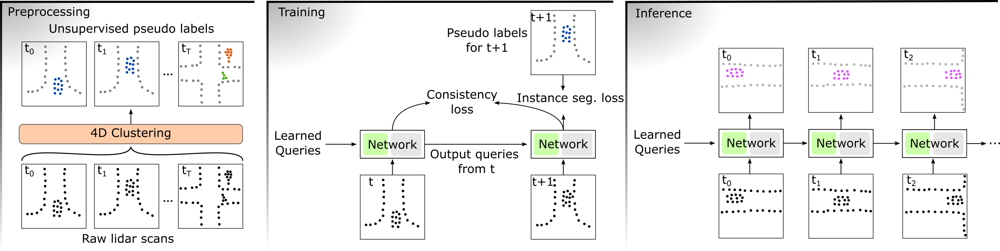

# UNIT: Unsupervised Online Instance Segmentation through Time

Official Pytorch implementation of the method **UNIT**. Check out the [project website](https://csautier.github.io/unit) and the [article](https://arxiv.org/abs/2409.07887) for more details!

**UNIT: Unsupervised Online Instance Segmentation through Time**,
by *Corentin Sautier, Gilles Puy, Alexandre Boulch, Renaud Marlet, and Vincent Lepetit*



If you use UNIT in your research, please cite:
```
@article{sautier2025unit,
  title = {{UNIT}: Unsupervised Online Instance Segmentation through Time},
  author = {Corentin Sautier and Gilles Puy and Alexandre Boulch and Renaud Marlet and Vincent Lepetit},
  arxiv={2310.17504},
  journal={arXiv},
  year = {2025}
}
```

## How to use

### Datasets

This project has been adapted to [SemanticKITTI](http://www.semantic-kitti.org/tasks.html#semseg), [nuScenes](https://www.nuscenes.org/lidar-segmentation) and [PandaSet](https://pandaset.org/). Please provide the datasets in the datasets folder, with names in lowercase letters.

PandaSet does not natively provide instance ground-truth. We provide the code to infer them, independently for the two different Lidar sensors of this dataset, PandarGT and Pandar64. Please run `python create_instance_gt_pandaset.py --sensor pandargt` to run the pre-processing on PandarGT if you intend to use this dataset.

### Using our checkpoints

| SemanticKITTI       | [non-temporal](https://github.com/valeoai/UNIT/releases/download/v1.0/sk_single.ckpt) | [temporal](https://github.com/valeoai/UNIT/releases/download/v1.0/sk_temporal.ckpt) |
|---------------------|----------------------|------------------|
| NuScenes            | [non-temporal](https://github.com/valeoai/UNIT/releases/download/v1.0/ns_single.ckpt) | [temporal](https://github.com/valeoai/UNIT/releases/download/v1.0/ns_temporal.ckpt) |
| PandaSet (PandarGT) | [non-temporal](https://github.com/valeoai/UNIT/releases/download/v1.0/pdgt_single.ckpt) | [temporal](https://github.com/valeoai/UNIT/releases/download/v1.0/pdgt_temporal.ckpt) |


### Obtaining input segments (4D-Seg)

For SemanticKITTI, you can directly [download](https://github.com/valeoai/UNIT/releases/download/v1.0/segments_gridsample_sk.tar.gz) the pre-processing as re-running Patchwork on your side can be complicated. Alternatively we provide the preprocessing code using Patchwork++, but please note this was not what the article used.

For the other datasets, you must install [Patchwork++](https://github.com/url-kaist/patchwork-plusplus) and run `preprocess_nuscenes.py` and `preprocess_pandaset.py`. This may take several hours, depending on your CPU.

### Training the model

We always start by training the model on a single frame (non-temporal). In the Mask3D directory, run the following commands for respectively SemanticKITTI, PandaSet and nuScenes:

`python main_instance_segmentation.py general.experiment_name=sk_single data/datasets=semantic_kitti data.batch_size=3 general.num_frames=1 data.test_batch_size=3 trainer.max_epochs=50`

`python main_instance_segmentation.py general.experiment_name=pdgt_single data/datasets=pandaset_pandargt data.batch_size=3 general.num_frames=1 data.test_batch_size=3 trainer.max_epochs=150`

`python main_instance_segmentation.py general.experiment_name=ns_single data/datasets=nuscenes data.batch_size=3 general.num_frames=1 data.test_batch_size=3 trainer.max_epochs=4`

To train the temporal models, run the following commands for respectively SemanticKITTI, PandaSet and nuScenes:

`python main_instance_segmentation.py general.experiment_name=sk_temporal general.checkpoint=saved/sk_single/last-epoch.ckpt data/datasets=semantic_kitti data.batch_size=4 general.num_frames=2 general.consistency_loss=true data.test_batch_size=4 trainer.max_epochs=50`

`python main_instance_segmentation.py general.experiment_name=pdgt_temporal general.checkpoint=saved/pdgt_single/last-epoch.ckpt data/datasets=pandaset_pandargt data.batch_size=5 general.num_frames=2 general.consistency_loss=true data.test_batch_size=5 trainer.max_epochs=150`

`python main_instance_segmentation.py general.experiment_name=ns_temporal general.checkpoint=saved/ns_single/last-epoch.ckpt data/datasets=nuscenes data.batch_size=5 general.num_frames=2 general.consistency_loss=true data.test_batch_size=5 trainer.max_epochs=4`


### Inference

Both for downloaded or trained checkpoints obtaining the checkpoints requires an inference pass.

The command to run the temporal inference on SemanticKITTI is `python inference_instance_segmentation.py general.experiment_name=sk_temporal general.checkpoint=saved/sk_temporal/last-epoch.ckpt data.batch_size=1 general.forward_queries=true data/datasets=semantic_kitti data.predict_mode=validation`

Adapt options accordingly for other datasets or checkpoints. If you want to infer non-temporal instances, you need to deactive the auto-regressive mechanism using `general.forward_queries=false`.

Predictions are stored in the *assets* directory of the dataset and is computed by default for the validation set only.

### Evaluating the results

In the *evaluation* directory, run `python evaluate_4dpanoptic_sk -p ../datasets/semantickitti/assets/sk_temporal` or adapt for other datasets or instance predictions. 
The evaluation of nuScenes is especially slow, as the optimized version of 4D-PLS produces overflow on this dataset.

### Troubleshooting

To save memory, this code utilizes mixed-precision using bf16, only available for newer hardware. You can add the option "general.precision=32" to the options to deactivate change this behavior, at the cost of higher memory usage.
